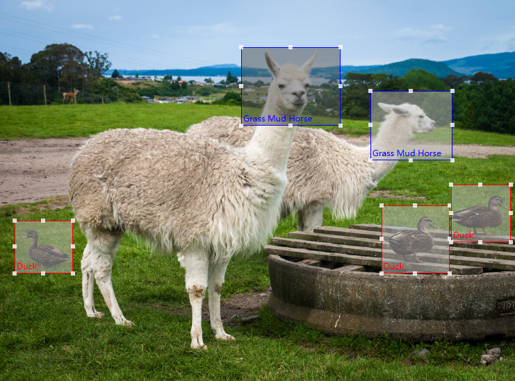

# simple-image-label

[View English readme](README.md) | [查看中文版readme](README-zh.md)  
Simple image annotate use in JavaScript , support YOLO and VOC annotate point for object detection or deep-learning.

## Preview



## Use in your project

### Install simple-image-label
```bash
# npm
npm install simple-image-label -S
# yarn
yarn add simple-image-label
# pnpm
pnpm add simple-image-label
```
#### Use in JavaScript

```html
<div id="YourElementId"></div>
```

```js
// use require
const SimpleImageLabel = require('../libs/simpleImageLabel').default
// use es6 import
import SimpleImageLabel from '../libs/simpleImageLabel'
// use simple image label in your html element, must use id selector
const simpleImageLabel = new SimpleImageLabe({
    el: 'YourElementId', 
    imageUrl: 'yourImageUrl', 
    labels: [],
    contextmenu: (e) => {
        // mouse right click event
    },
    labelClick: (label) => {
        // label click event
    },
    error: (err) => {
        // error event
        console.log(err);
    }
});
```

#### Use in vue3

```html
<template>
    <div id="YourElementId"></div>
</template>
<script setup>
import SimpleImageLabel from 'simple-image-label'
import { ref, onMounted } from 'vue';
const simpleImageLabel = ref(null);
onMounted(() => {
    simpleImageLabel.value = new SimpleImageLabel({
        el: 'YourElementId'
        imageUrl: props.imageUrl,
        labels: props.labels,
        contextmenu: (e) => {
            emit('contextmenu', e)
        },
        labelClick: (label) => {
            emit('labelClick', label)
        },
        error: (e) => {
            emit('error', e)
        }
    });
})
</script>
```

#### Use in React
```jsx
import SimpleImageLabel from 'simple-image-label';
import img from './x.png'
import { useEffect } from 'react';
const ImageLabelComponent = () => {
    let simpleImageLabel = null
    useEffect(() => {
        initSimpleDom()
    }, [])
    function initSimpleDom() {
        simpleImageLabel = new SimpleImageLabel({
            el: 'YourElementId',
            imageUrl: img,
            labels: [],
            contextmenu: (e) => {
                console.log(e);
            },
            labelClick: (label) => {
                console.log(label);
            },
            error: (e) => {
                console.log(e);
            }
        })
    }
    function getAllLabels() {
        const labels = simpleImageLabel.getLabels()
        console.log('labels', labels);
    }
    return (
        <div>
            <div id="YourElementId"></div>
            <button onClick={getAllLabels}>Get all labels</button>
        </div>
    );
}
export default ImageLabelComponent;
```


## Develop & Install & Run demo

Install
```bash
# npm
npm install
# yarn
yarn
# pnpm
pnpm install
```

Run
```bash
# npm
npm run start
# yarn
yarn start
# pnpm
pnpm run start
```

Build
```bash
# npm
npm run build
# yarn
yarn build
# pnpm
pnpm run build
```

## API

### `SimpleImageLabel options`
| Property      | Type       | Description                   |
| ------------- | ---------- | ----------------------------- |
| `el`          | `string`   | Html element id               |
| `imageUrl`    | `string`   | Image path                    |
| `labels`      | `array`    | default labels                |
| `readOnly`    | `boolean`  | Enable/Disable read only mode |
| `contextmenu` | `function` | right click event             |
| `labelClick`  | `function` | left click event              |
| `error`       | `function` | error event                   |


### `SimpleImageLabel function`
| function                         | params       | Description                                   |
| -------------------------------- | ------------ | --------------------------------------------- |
| `getLabels()`                    | -            | Get all labels                                |
| `activeLabel()`                  | -            | Get active label                              |
| `setImage(imageUrl)`             | `imageUrl`   | Set image                                     |
| `setLabels(labels)`              | `labels`     | Set labels                                    |
| `getImageInfo()`                 | -            | Get image width and height                    |
| `getCoordinate(label)`           | `label`      | Get label coordinate                          |
| `getLabelsCoordinate()`          | -            | Get all labels coordinate                     |
| `convertToYoloCoordinate(label)` | `label`      | Get label YOLO coordinate                     |
| `getLabelsYoloCoordinate()`      | -            | Get all labels YOLO coordinate                |
| `setLabelActive(uuid)`           | `uuid`       | Set label active status by uuid               |
| `clearAllLabelActive()`          | -            | Clear active status                           |
| `removeAllLabels()`              | -            | Remove all labels                             |
| `removeLabelByUuid(uuid)`        | `uuid`       | Remove a label by uuid                        |
| `setLabelByUuid(uuid, attr)`     | `uuid, attr` | Set label attr by uuid. `attr` type is object |
| `getLabelByUuid(uuid)`           | `uuid`       | Get label by uuid                             |
| `setReadOnly(readOnly)`          | `readOnly`   | Set read only mode.`readOnly` type is boolean |